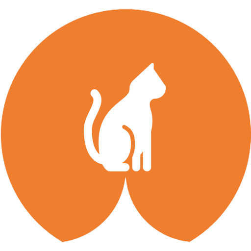

# FindMyPet



Demo: [FindMyPet](https://findmypet.netlify.com)

Frontend: [enginma_findmypet](https://github.com/averdier/enigma_findmypet)


Bienvenue sur **FindMyPet**, la première application de géolocalisation des vos animaux avec des puces de traçage à très grande autonomie. **FindMyPet** utilise les technologies SIGFox et Bluetooth 5 afin de posséder un des meilleurs réseau de couverture, mais surtout, une des technologie les moins énergivore du marché.

Groupe :
- [Arthur Verdier](https://github.com/averdier)
- [Romain Verdin](https://github.com/romoliere)
- [Rémi Lardier](https://github.com/remi0411)

## Statut

- [x] Authentification forte
- [x] Lister les animaux
- [x] Créer un animal (position initial 104 rue nationale Lille)
- [x] S'abonner aux notifcations push
- [x] Annuler l'abonnement aux notifications push
- [x] Envoie de notifications push
- [x] Service d'alerte pour les animaux hors de leurs zone d'habitation
- [x] Canal pub/sub pour la position des animaux
- [] Modifier un animal
- [] Supprimer un animal

## Variables d'environnement

Quelques variables d'environnements sont disponibles afin de modeler l'application à votre convenance.

|Nom|Description|Exemple|
|----------------|-------------------------------|-----------------------------|
| APP_CONFIG | Configuration de l'application | default |
| PROVIDER_REGION | Region du fournisseur AWS | eu-central-1 |
| PET_TABLE | Nom de la table DynamoDB contenant les animaux | findmypet-pet-table-dev |
| SUBSCRIPTION_TABLE | Nom de la table DynamoDB contenant les souscriptions push | findmypet-subscription-table-dev |
| AUTH_POOL | Adresse du fournisseur d'authentification Cognito | eu-central-1_4Q91 |
| AUTH_CLIENT_ID | Identifiant de l'application web | 540q9q99kkact1aj1 |
| PET_QUEUE | Nom du canal pub/sub pour la position des animaux | findmypet-pet-dev |
| PUSH_QUEUE | Nom du canal pub/sub pour l'envoie de notifications push | findmypet-push-dev |
| PUSH_KEY | Clé d'authentification permettant l'envoie de notifications push | a3z7ene3CsVear9zwcuH3g8TG6 |

## Fonctions
| Nom | Description | Event |
|----------------|-------------------------------|-----------------------------|
| fakeLocationService | Simule de déplacement de l'ensemble des animaux | cron (5 minutes) |
| bigLocationUpdate | Simule un grand déplacement pour déclencher une notification push | manual |
| petLocationService | Enregistre la position d'un animal à partir d'un événement | sqs |
| zoneAlertService | Demande l'envoi une notification push quand un animal et en dehors de sa zone d'habitation | sqs |
| pushService | Envoie une notification push à partir d'un événement | sqs |
| getPetList | Retourne la liste des animaux d'un utilisateur | http |
| createPet | Ajoute un animal à l'utilisateur | http |
| createSubscription | Ajoute un abonnement aux notifications push à l'utilisateur | http |
| deleteSubscription | Annule l'abonnement aux notifications push d'un utilisateur | http |

## Installation

Prérequis :
- Python 3.6
- NodeJs
- AWS account
- Serverless CLI
- AWS CLI

```
npm i
python -m venv env
source env/bin/activate

pip install -r requirements.txt
```

## Developpement
```
sls wsgi serve
```

## Production
```
sls deploy
```